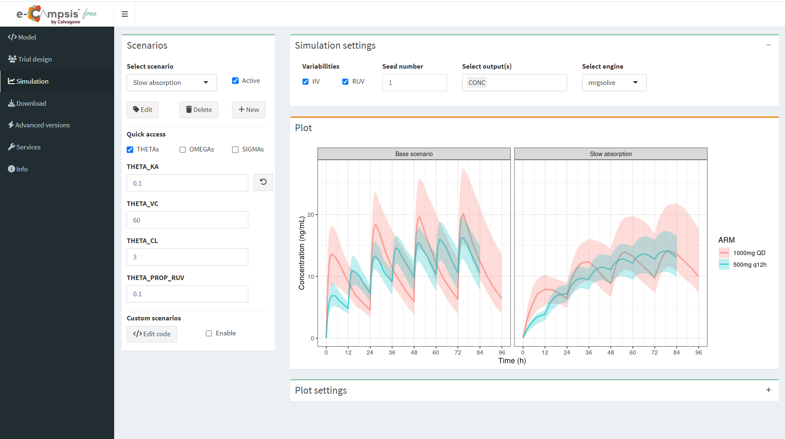
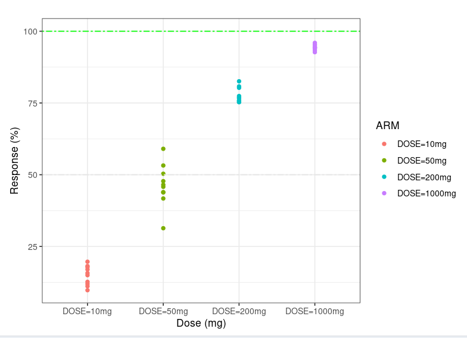
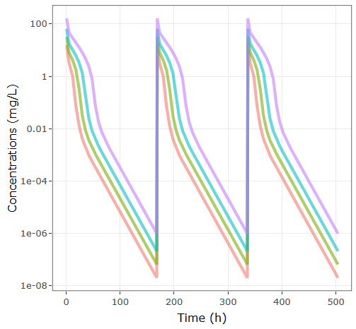
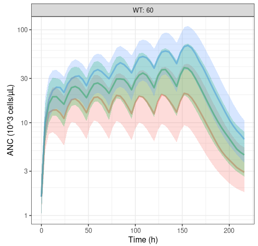
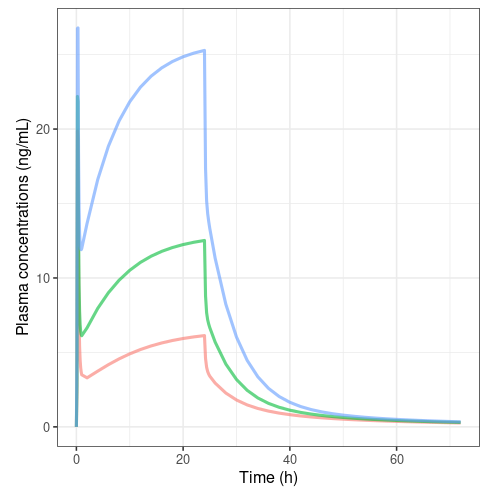

## Discover e-Campsis

[e-Campsis](https://ecampsis.shinyapps.io/free/) is a free web application developed by Calvagone that provides an intuitive and user-friendly interface for setting up population PK/PD simulations. The app is built on the R-package [campsis](https://github.com/Calvagone/campsis), which serves as a powerful frontend for running model-based simulations using mrgsolve or rxode2.

[](https://ecampsis.shinyapps.io/free/)

Want to try out? Click [**here**](https://ecampsis.shinyapps.io/free/) or click on the screenshot above to test the free version and enjoy the power of e-Campsis.

The app consists of 4 main sections:

-   Model: a powerful model editor to edit your Campsis model online. Try out one of the numerous models available from the library and adapt it to your needs.
-   Trial design: an easy-to-use interface to quickly set-up the dosing regimen, observation times and covariates.
-   Simulation: a single screen dedicated to the simulation configuration and visualisation of the results. Explore different scenarios of parameter settings quickly and interactively.
-   Download: last but not least, download the model, parameters and the whole code of the simulation to reproduce what you see in the app on your computer using the open-source package [campsis](https://github.com/Calvagone/campsis).

Click [**here**](https://youtu.be/uypETm6aoNc) for a short video explaining how to set-up and run your first simulation.

## Use cases

The following section lists a few pre-configured example cases we have prepared for you to get an idea of e-Campsis' capabilities.

::: level
::: column-use-case-left
<a href="https://ecampsis.shinyapps.io/emax-dose-response/"></a>
:::

::: column-use-case-right
#### [Simple dose reponse model](https://ecampsis.shinyapps.io/free/?usecase=emax-dose-response)

This is a straight-forward example of a sigmoidal dose-response model to illustrate how you can easily simulate non-longitudinal models with e-Campsis. In the present case we use a dosing compartment where the amount per arm is injected as a bolus. Since we have no time-dependency, we only need to specify a single observation time point.
:::
:::

::: level
::: column-use-case-left
<a href="https://ecampsis.shinyapps.io/pbpk-tmdd/"></a>
:::

::: column-use-case-right
#### [PBPK-TMDD model (Cao et al, 2013)](https://ecampsis.shinyapps.io/free/?usecase=pbpk-tmdd)

This model is an adaptation of the second-generation minimal PBPK model for monoclonal antibodies initially described by Cao et al. 2013 and later refined and applied to interspecies-scaling by Zhao et al. 2015. Physiological parameters like lymph or plasma flow and volumes are scaled by body weight, to allow simple scaling between species on the basis of body weight. Binding of the antibody to it's target occurs in the plasma compartment and is handled by the full target-mediated drug disposition (TMDD) approach with the following parameters:

-   BL_target: Baseline target concentration (nM)
-   KD_target: Equilibrium dissociation constant (nM)
-   KOFF_target: Rate constant of dissociation of the antibody-target complex (1/day)
-   KDEG_target: Degradation rate of the free target (1/day)
-   KINT_target_AB: Internalization or degradation rate of the antibody-target complex (1/day)
:::
:::

::: level
::: column-use-case-left
<a href="https://ecampsis.shinyapps.io/filgrastim/"></a>
:::

::: column-use-case-right
#### [Filgrastim model (Krzyzanski et al, 2010)](https://ecampsis.shinyapps.io/free/?usecase=filgrastim)

Filgrastim is a recombinant human granulocyte colony stimulating factor (G-CSF) that stimulates production of neutrophils. The model depicted the decaying trend in Cmax values with repeated doses and an increase in absolute neutrophil count (ANC) consistently with an increase in the G-CSF receptor pool. Simulated time courses of the total clearance exhibited an increasing pattern. The increase in filgrastim clearance on multiple dosing was attributed to the increased neutrophil count in the bone marrow and blood paralleled by an increase in the total G-CSF receptor density.
:::
:::

::: level
::: column-use-case-left
<a href="https://ecampsis.shinyapps.io/draflazine/"></a>
:::

::: column-use-case-right
#### [Draflazine model (Snoeck et al, 1999)](https://ecampsis.shinyapps.io/free/?usecase=draflazine)

The red blood cell/plasma distribution of draflazine (a nucleoside transport inhibitor which is cardioprotective due to potentiation of receptor mediated effects of adenosine in the ischemic myocardium) was non-linear and characterized as a capacity-limited specific binding to the nucleoside transporter on the red blood cells. Binding to the nucleoside transporter on red blood cells is an important determinant of the pharmacokinetics of draflazine and a high degree of occupancy of the transporter by draflazine is required to inhibit adenosine breakdown ex vivo. It is suggested that the red blood cell nucleoside transporter occupancy may serve as a useful pharmacodynamic endpoint in dose ranging studies with draflazine.
:::
:::

## Versions
#### free
The free web version of e-Campsis is accessible to everyone, without registration. However, to limit and control server usage it comes with certain restrictions regarding the simulation size.

#### free+
If you want to simulate up to 16 arms or scenarios (combined), 100 subjects/arm and 250 observations/arm we invite you to become an authorized user of e-Campsis free+. Please click on the link below to send us a pre-filled email  and you will get an invitation to register as soon as possible:
```{=html}
<a class="mailtoui" href="mailto:campsis@calvagone.com?subject=e-Campsis%20free%2B&amp;cc=&amp;bcc=&amp;body=Hello%2C%20%0A%0A%20I%27d%20like%20to%20get%20access%20to%20e-Campsis%20free%2B.%20%0A%0A%20Thank%20you%2C%20%0A%0A%20%3CYour%20name%3E%20%0A%0ABy%20sending%20this%20e-mail%20I%20agree%20that%20Calvagone%20gets%20in%20touch%20with%20me%20regarding%20Campsis%20and%20associated%20services.%20I%20understand%20that%20Calvagone%20will%20never%20sell%20or%20distribute%20my%20contact%20information%20to%20a%20third%20party%20and%20promises%20to%20keep%20my%20details%20safe%20and%20secure.%20If%20I%20don%27t%20want%20to%20receive%20e-mails%20from%20Calvagone%20anymore%20or%20have%20questions%20around%20their%20GDPR%20compliance%2C%20I%20will%20contact%20them%20at%20contact%40calvagone.com.">campsis@calvagone.com</a>
```

#### pro
We are working without rest on a pro-version of e-Campsis which will include many additional features such as, import and automatic translation of NONMEM code, post-processing of simulations to calculate NCA parameters and summarize them in a table, easy saving and loading of simulation projects and much more.
We plan to have a beta version ready in Q4 this year. 
Please stay tuned and meanwhile enjoy the free versions of e-Campsis!

