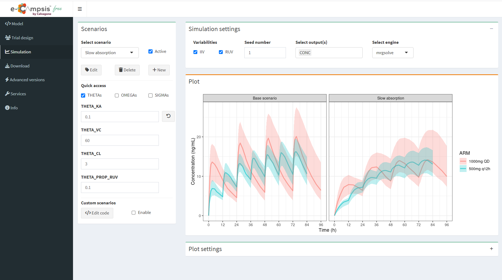

[e-Campsis](https://www.e-campsis.com)® is an application developed by Calvagone that provides an intuitive and user-friendly interface for setting up population PK/PD simulations.
The app is built on the R-package [campsis](https://github.com/Calvagone/campsis), which serves as a powerful frontend for running model-based simulations using mrgsolve or rxode2.

Go to [**e-campsis.com**](https://www.e-campsis.com) for more information!