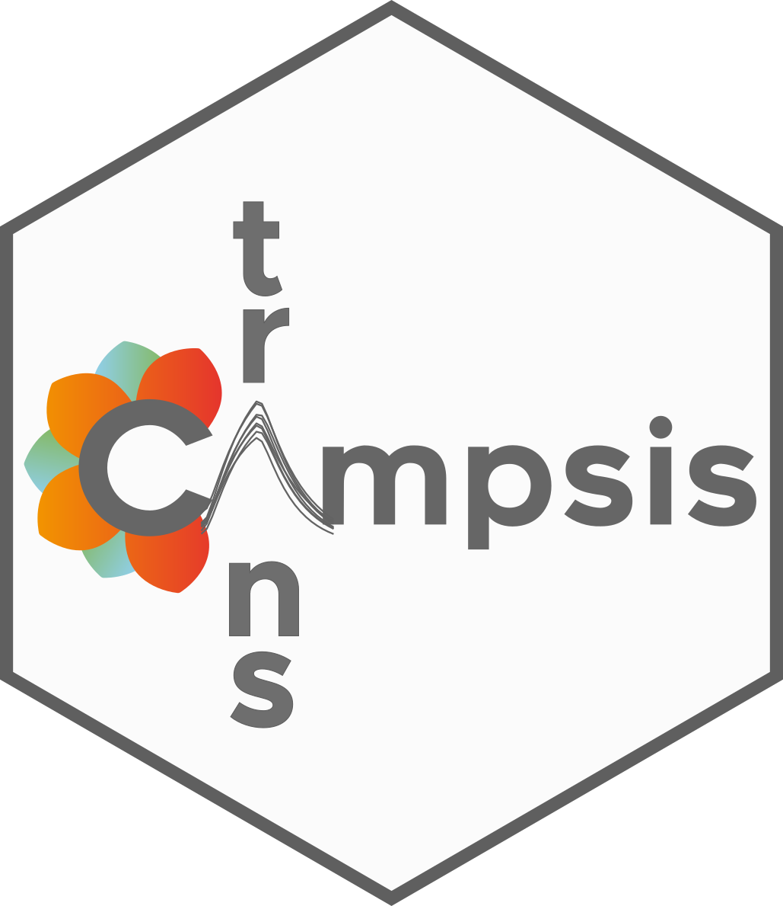
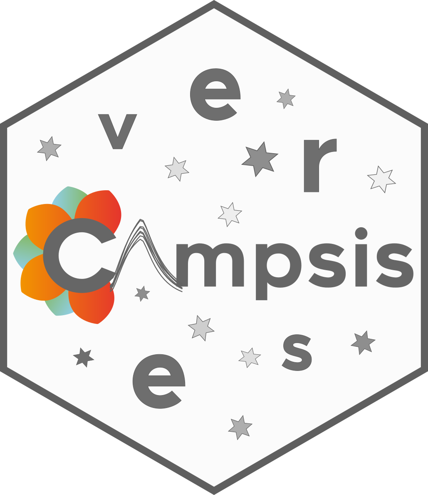

```{r setup, include = FALSE}
source("_R/campsis_setup.R")
```


Welcome to the official website of the Campsis suite.  

Campsis is a PK/PD simulation platform developed by [Calvagone](http://www.calvagone.com). Most packages of the suite are open-source and can be downloaded from GitHub.  

Want to learn more? Please visit our section [What is Campsis](./intro.html).  
Want to give it a try? Please follow the [Installation](./install.html) instructions and have a look at the documentation below.

## Our suite of packages

<div class="level">
<div class="column-left">
<a href="https://github.com/Calvagone/campsis"></a>
</div>

<div class="column-right" style="padding-left: 30px;">

#### [campsis](https://github.com/Calvagone/campsis)

A generic PK/PD simulation platform based on rxode2 and mrgsolve engines.  
Please check out our [documentation](https://calvagone.github.io/campsis.doc/).

</div>
</div>

<!-- Separator -->

<div class="level">
<div class="column-left">
<a href="https://github.com/Calvagone/campsismod"></a>
</div>

<div class="column-right" style="padding-left: 30px;">

#### [campsismod](https://github.com/Calvagone/campsismod)

Generic implementation of a drug model in pharmacometrics.  
Please check out our [documentation](https://calvagone.github.io/campsismod.doc/).

</div>
</div>

<!-- Separator -->

<div class="level">
<div class="column-left">
<a href="https://github.com/Calvagone/campsisnca"></a>
</div>

<div class="column-right" style="padding-left: 30px;">

#### [campsisnca](https://github.com/Calvagone/campsisnca)

Analyse your simulation output using non-compartmental analysis (NCA).   
Please check out the [README](https://github.com/Calvagone/campsisnca?tab=readme-ov-file) on GitHub. It contains many useful examples.

</div>
</div>

<!-- Separator -->

<div class="level">
<div class="column-left">
<a href="https://github.com/Calvagone/campsismisc"></a>
</div>

<div class="column-right" style="padding-left: 30px;">

#### [campsismisc](https://github.com/Calvagone/campsismisc)

Easily perform forest plots and sensitivity analyses using Campsis.   
Please check out the [README](https://github.com/Calvagone/campsismisc?tab=readme-ov-file) on GitHub. It contains many useful examples.

</div>
</div>

<!-- Separator -->

<div class="level">
<div class="column-left">
<a href="https://github.com/Calvagone/campsisqual"></a>
</div>

<div class="column-right" style="padding-left: 30px;">

#### [campsisqual](https://github.com/Calvagone/campsisqual)

Qualify your installation of the Campsis suite and generate an IQ/OQ report.   
Please check out the [README](https://github.com/Calvagone/campsisqual) or contact [Calvagone](mailto:campsis@calvagone.com) for more information.

</div>
</div>

<!-- Separator -->

<div class="level">
<div class="column-left">
<a href="./ecampsis"></a>
</div>

<div class="column-right" style="padding-left: 30px;">

#### [e-Campsis](./ecampsis.html)

e-Campsis is a web application that provides an intuitive and user-friendly interface for setting up population PK/PD simulations. Discover [e-Campsis](./ecampsis.html) here or check out our [documentation](https://calvagone.github.io/ecampsis.doc/).

</div>
</div>

<!-- Separator -->

<div class="level">
<div class="column-left">

</div>

<div class="column-right" style="padding-left: 30px;">

#### [campsistrans](./ecampsis.html)

Campsistrans is dedicated to importing models from a variety of sources. Currently, it imports your models from NONMEM (including parameter estimates and variance-covariance matrix). Note that this package, although not open-source, is available in the pro version of [e-Campsis](./ecampsis.html).

</div>
</div>

<!-- Separator -->

<div class="level">
<div class="column-left">

</div>

<div class="column-right" style="padding-left: 30px;">

#### [campsisverse](https://github.com/Calvagone/campsisverse)

Last but not least, Campsisverse is our package manager. It allows you to install the Campsis suite and its dependencies in one go. Based on `renv`, it ensures reproducibility of your simulation environment in R.

</div>
</div>

