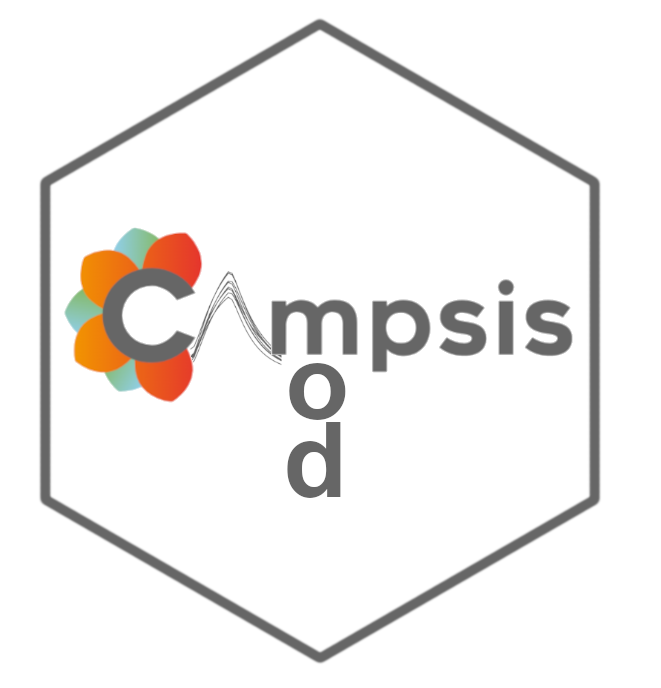

```{r setup, include = FALSE}
source("_R/campsis_setup.R")
```


Welcome to the official website of the Campsis suite.  

Campsis is a PK/PD simulation platform developed by [Calvagone](http://www.calvagone.com). The suite comprises two R packages `campsismod` and `campsis` which are both free and open-source on GitHub (see links below).  

Want to learn more? Please visit our section [What is Campsis](./intro.html).  
Want to give it a try? Please follow the [Installation](./install.html) instructions and have a look at the documentation below.

## Packages on Github

<div class="level">
<div class="column-left">
<a href="https://github.com/Calvagone/campsis"></a>
</div>

<div class="column-right">

#### [campsis](https://github.com/Calvagone/campsis)

A generic PK/PD simulation platform based on rxode2, RxODE and mrgsolve engines.

</div>
</div>

<div class="level">
<div class="column-left">
<a href="https://github.com/Calvagone/campsismod"></a>
</div>

<div class="column-right">

#### [campsismod](https://github.com/Calvagone/campsismod)

Generic implementation of a drug model in pharmacometrics.

</div>
</div>

## Documentation

<div class="level">
<div class="column-left">
<a href="https://calvagone.github.io/campsis.doc/"></a>
</div>

<div class="column-right">

#### [campsis.doc](https://calvagone.github.io/campsis.doc/)

Documentation of R package campsis.  
Please check out our many vignettes available in this pkgdown website.

</div>
</div>


<div class="level">
<div class="column-left">
<a href="https://calvagone.github.io/campsismod.doc/"></a>
</div>

<div class="column-right">

#### [campsismod.doc](https://calvagone.github.io/campsismod.doc/)

Documentation of R package campsismod.  
Please check out our many vignettes available in this pkgdown website.

</div>
</div>
