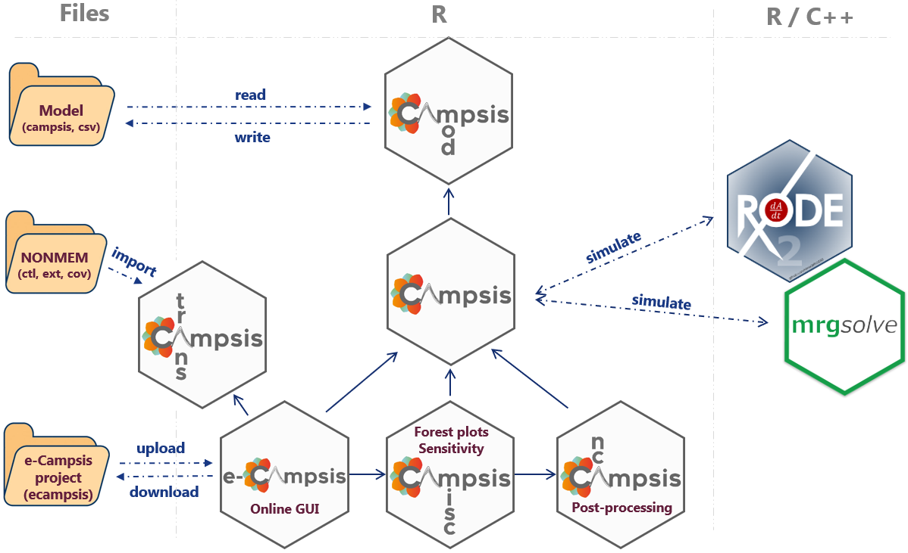

## Introduction

Campsis is an open-source PK/PD simulation platform built on top of the simulation packages [`rxode2`](https://github.com/nlmixr2/rxode2) and [`mrgsolve`](https://github.com/metrumresearchgroup/mrgsolve). It provides an abstraction layer over the underlying processes of writing a model, assembling a dataset and running, in the background, a simulation with these packages.   

Campsis is developed by software engineers working at [Calvagone](http://www.calvagone.com/) and designed for pharmacometricians who are looking for an easy and intuitive way to run model-based simulations.
The packages are developed in R, which makes it possible to integrate your simulation into an R workflow.

More broadly, Campsis is part of a larger ecosystem of packages, called the Campsis suite. The goal of this suite is to provide a comprehensive set of tools to help pharmacometricians to build, run and analyze simulations. A short introduction to these packages is given below.

## Campsis family

As shown in the schematic below, Campsis plays a central role in the Campsis suite, as it is the package that orchestrates the simulation process. While the package [`campsismod`](https://github.com/Calvagone/campsismod) takes care of the pharmacometric model and its translation to rxode2 or mrgsolve, the [`campsis`](https://github.com/Calvagone/campsis) package is more focused on the creation of the dataset (study design) and the simulation process.



In addition to these two interconnected core packages, the Campsis suite includes additional packages for post-processing and analysis. The first package, [`campsisnca`](https://github.com/Calvagone/campsisnca), specializes in non-compartmental analysis (NCA) of simulation results. The second package, [`campsismisc`](https://github.com/Calvagone/campsismisc), provides various utilities tailored for pharmacometricians. Among its key features are forest plots, which visualize the uncertainty of covariate effects on model parameters or NCA metrics, and tornado plots, which illustrate the sensitivity of model parameters to NCA metrics. These additional packages enhance the capabilities of the Campsis suite, making it a versatile set of packages for pharmacometric analysis.

Moreover, Calvagone has developed [e-Campsis](./ecampsis.html), a web-based graphical user interface that builds on the capabilities of the existing Campsis packages. e-Campsis streamlines simulation setup and execution, offering an interactive platform for result visualization. Users can also download complete simulation scripts for offline execution using the open-source Campsis suite.  
Additionally, e-Campsis features a NONMEM model importer, enabling users to import and simulate NONMEM models seamlessly. This functionality is based on the campsistrans package, as shown in the schematic.

## A quick example of Campsis

Load a 1-compartment model with absorption compartment from the model library.


```{r, message=F}
library(campsis)
model <- model_suite$nonmem$advan2_trans2
```

For instance, let's adapt the population estimate for clearance.

```{r}
model <- model %>% replace(Theta(name="CL", value=10))
```

Assume some drug is already present in the central compartment (e.g. 0.1 ng/mL with 20% CV across individuals).

```{r}
model <- model %>%
  add(Theta(name="CENTRAL_INIT", value=0.1)) %>%
  add(Omega(name="CENTRAL_INIT", value=20, type="cv%")) %>%
  add(InitialCondition(compartment=2, rhs="THETA_CENTRAL_INIT*exp(ETA_CENTRAL_INIT)*V"))
```

Let's now create a small dataset of 10 individuals and let's infuse 100 mg at time 0, for a duration of 10 hours.

```{r}
dataset <- Dataset(10) %>% 
  add(Infusion(time=0, amount=100, compartment=1, duration=10)) %>%
  add(Observations(0:24))
```

We can now simulate this very simple model and dataset.

```{r, warning=FALSE, message=FALSE}
results <- model %>% simulate(dataset=dataset, seed=0)
```

Finally, we can use `ggplot2` to plot these results.

```{r campsis_a_letter_plot, fig.height=4, fig.width=6}
library(ggplot2)
ggplot(results, aes(x=TIME, y=CONC, group=ID)) +
  geom_line(colour="gray39", linewidth=1) + theme_bw()
```

Well done, you just drew the `A` letter of our Campsis logo.

## Going further

If you haven't installed Campsis, please visit the [installation](./install.html) section.  

If you are looking for some more examples, please check out our documentation websites or READMEs:

- Package [`campsismod`](https://calvagone.github.io/campsismod.doc/)
- Package [`campsis`](https://calvagone.github.io/campsis.doc/)
- Package [`campsisnca`](https://github.com/Calvagone/campsisnca)
- Package [`campsismisc`](https://github.com/Calvagone/campsismisc)

If you want to try out e-Campsis, please visit the [e-Campsis](./ecampsis.html) section.  

If you want to know more about our quality assurance process, please visit the [Quality](./quality.html) section.

