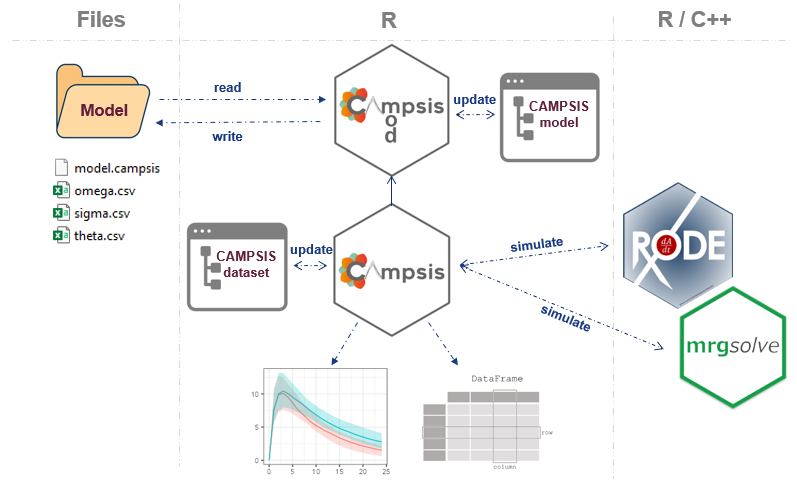

## Introduction

Campsis is a open-source PK/PD simulation platform built on top of the open-source simulation packages [`rxode2`](https://github.com/nlmixr2/rxode2), [`RxODE`](https://github.com/nlmixrdevelopment/RxODE) and [`mrgsolve`](https://github.com/metrumresearchgroup/mrgsolve). It provides an abstraction layer over the underlying processes of writing a model, assembling a dataset and running, in the background, a simulation with these packages.   

Campsis is developed by software engineers working at [Calvagone](http://www.calvagone.com/) and designed for pharmacometricians who are looking for an easy and intuitive way to run model-based simulations.
The packages are developed in R, which makes it possible to integrate your simulation(s) into an R workflow (e.g. standard R script, `Rmarkdown`, `Shiny` app, etc.).

## Brief overview

As shown in the schematic below, Campsis comprises two inter-connected R packages: [`campsismod`](https://github.com/Calvagone/campsismod) and [`campsis`](https://github.com/Calvagone/campsis). The first package allows the user to assemble, read, write or manipulate a PK/PD model. It also provides useful utilities to export the model to RxODE or mrgsolve. The second package allows the user to assemble the dataset in a very intuitive manner. Once the user's dataset is ready, the package is in charge of preparing the simulation, calling RxODE or mrgsolve and returning the results, for a given model, dataset and desired simulation settings.



## A quick example

Load a 1-compartment model with absorption compartment from the model library.


```{r, message=F}
library(campsis)
model <- model_suite$nonmem$advan2_trans2
```

For instance, let's adapt the population estimate for clearance.

```{r}
model <- model %>% replace(Theta(name="CL", value=10))
```

Assume some drug is already present in the central compartment (e.g. 0.1 ng/mL with 20% CV across individuals).

```{r}
model <- model %>%
  add(Theta(name="CENTRAL_INIT", value=0.1)) %>%
  add(Omega(name="CENTRAL_INIT", value=20, type="cv%")) %>%
  add(InitialCondition(compartment=2, rhs="THETA_CENTRAL_INIT*exp(ETA_CENTRAL_INIT)*V"))
```

Let's now create a small dataset of 10 individuals and let's infuse 100 mg at time 0, for a duration of 10 hours.

```{r}
dataset <- Dataset(10) %>% 
  add(Infusion(time=0, amount=100, compartment=1, duration=10)) %>%
  add(Observations(0:24))
```

We can now simulate this very simple model and dataset.

```{r, warning=FALSE, message=FALSE}
results <- model %>% simulate(dataset=dataset, seed=0)
```

Finally, we can use `ggplot2` to plot these results.

```{r campsis_a_letter_plot, fig.height=4, fig.width=6}
library(ggplot2)
ggplot(results, aes(x=TIME, y=CONC, group=ID)) +
  geom_line(colour="gray39", linewidth=1) + theme_bw()
```

Well done, you just drew the `A` letter of our Campsis logo.

## Going further

If you haven't installed Campsis, please visit the [installation](./install.html) section.  

If you are looking for some more examples, please check out our documentation websites:

- Package [`campsismod`](https://calvagone.github.io/campsismod.doc/)
- Package [`campsis`](https://calvagone.github.io/campsis.doc/)
