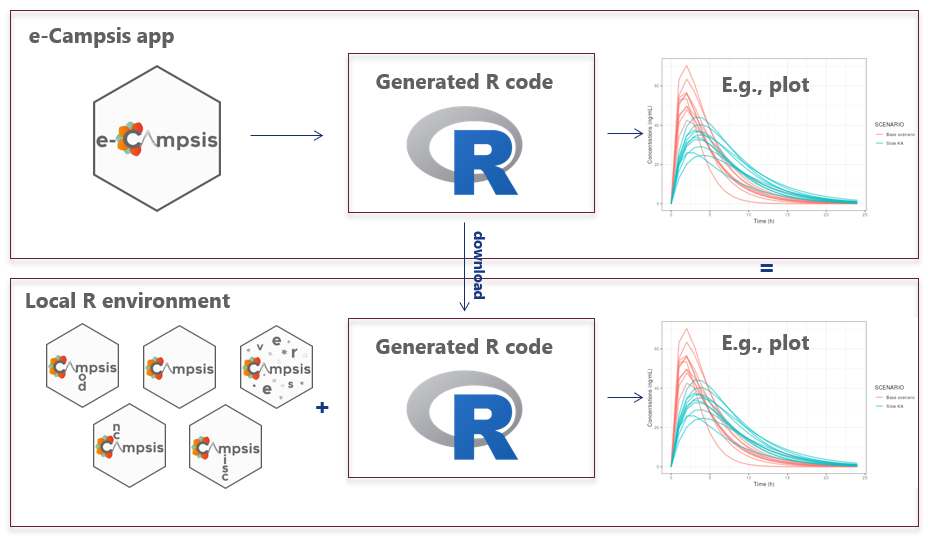
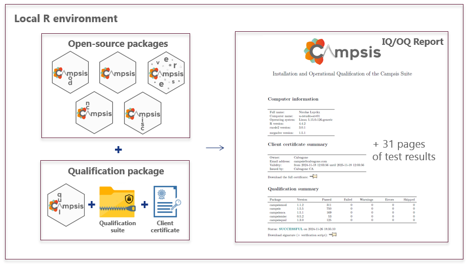
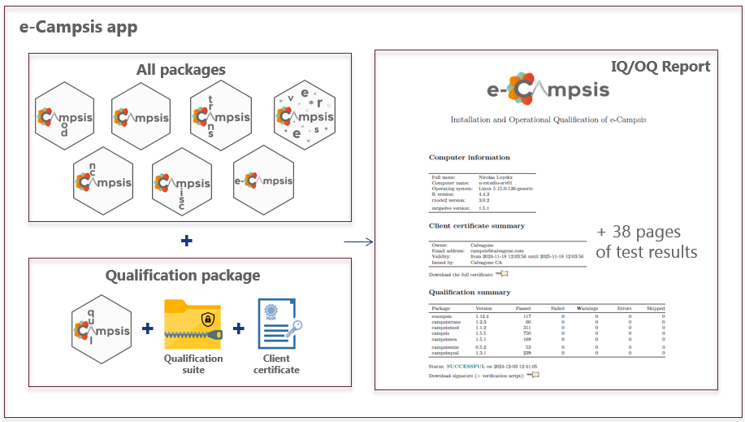
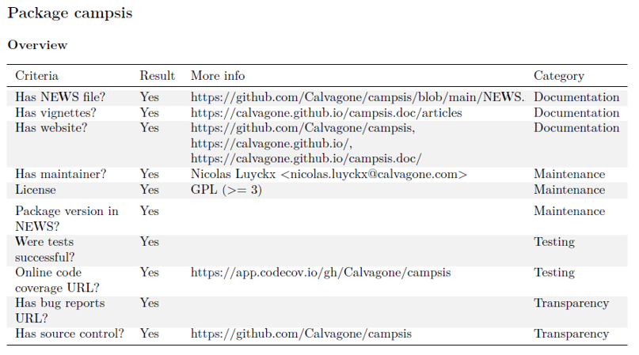
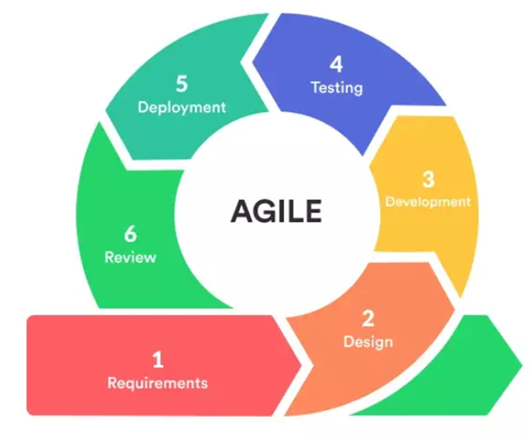

At Calvagone we are committed to developing  high-quality software that meets the rigorous standards of pharmaceutical research and development. Our quality assurance process, applied to all packages in the Campsis suite, is based on the following principles:

## Fully reproducible workflow

All the simulations performed with e-Campsis are fully reproducible thanks to the open-source suite of packages.  
In e-Campsis, the users can download the generated R code and run it on their own machine. The exact version of the packages and the dependencies, used by e-Campsis, can be locally restored using the [`campsisverse`](https://github.com/Calvagone/campsisverse) package, the installation manager for the Campsis suite. This allows the users to reproduce the results obtained with e-Campsis.

Typical workflow with Campsis/e-Campsis:

1. The user imports his/her model into e-Campsis
2. The study design is created and the simulations are run
3. Post-processing is performed (single replicate or multiple replicates)
4. The user downloads the generated R script and runs it on his/her machine or server with his current installation of the Campsis suite
5. Alternatively: a sandbox environment is automatically created with the exact same versions of the packages used by e-Campsis on the web   
6. The user reproduces the results obtained with e-Campsis on his computer with a fully reproducible R script that can be appended to a M&S report

Of course, the user is free to edit the R script before execution to, for example, customize plots or increase the number of replicates or individuals. 

{width=90%}

## Qualification of the Campsis suite

The Campsis suite can be installed easily with the [`campsisverse`](https://github.com/Calvagone/campsisverse) package, yet in regulated environments it needs to be ensured and documented that everything works as expected. We have developed a qualification packages to ensure that the Campsis suite is installed and operates properly on all platforms (local installation or server installation). This process is based on the following steps:

1. **Installation**: The Campsis suite is installed in your R distribution (see the different options [here](https://github.com/Calvagone/campsisverse)).
2. **Qualification**: The Campsis suite is qualified using the [`campsisqual`](https://github.com/Calvagone/campsisqual) package and our qualification suite of models; this encompasses tests of proper installation of all packages (i.e. installation qualification or IQ) as well as specific tests of the functions of each package and execution of a large number of PK/PD simulations with models from the library and comparing the results to true expected values. This procedure is called operational qualification (OQ).  In total over 1500 tests are run and more than 100 models are executed.
3. **Reporting**: A detailed IQ/OQ report is generated, signed digitally and serves as the proof of the qualification.

{width=90%}

This qualification process is part of a service offering by [Calvagone](mailto:campsis@calvagone.com) and includes: 

- The qualification suite of models
- The qualification report template
- The digital certificate and key
- Personalized support during the installation and qualification process
- Online introductory training
- A package of consulting hours that can be used for advanced  training, implementation of models, or further personalized support.

Contact us at [campsis@calvagone.com](mailto:campsis@calvagone.com) if you are interested in this service.

## Qualification of e-Campsis

Similarly to the qualification of the Campsis suite, e-Campsis the online graphical user interface is qualified at every release as follows*:

1. **Installation**: A [`Docker`](https://www.docker.com/) image of e-Campsis and the Campsis suite is made before every release
2. **Qualification**: The image is qualified using the [`campsisqual`](https://github.com/Calvagone/campsisqual) package and our qualification suite of models (see above)
3. **Reporting**: A report is output for the specific version of e-Campsis. It is signed digitally and it serves as the proof of the qualification.

* for hosting on our own server; on shinyapps.io the procedure differs slightly.

{width=90%}

## Package quality assessment

Our report, besides showing the detailed results of the tests, also includes a quality assessment of every Campsis package. This assessment is based on the  [`riskmetric`](https://github.com/pharmaR/riskmetric) package suggested by the `R Validation Hub` consortium ([https://www.pharmar.org/riskmetric/](https://www.pharmar.org/riskmetric/) to assess the quality of an R package. 

- **Has NEWS file?**: This type of file is important to keep the users informed about the changes in the package.
- **Has vignettes?**: Vignettes are important to show the users how to use the package.
- **Has website?**: A website is important to provide more information about the package and keep the users informed.
- **Has maintainer?**: The maintainer is important to keep the package up-to-date.
- **Has license?**: A license is important to protect the package and the users. Our Campsis suite is licensed under the GPL-3 license. This basically means that you can use the software for free, you can modify it, and you can distribute it. However, if you distribute the software, you must also distribute the source code.
- **Package version in NEWS**: Is the current version of the packages detailed in the NEWS file? This is important to keep the users informed about the recent changes in the package.
- **Were tests successful?**: This is important to ensure that the package is working properly. This is a prerequisite for a successful qualification of the Campsis suite. All tests must pass.
- **Online code coverage URL?**: Code coverage is important to ensure that the package is well tested. The code coverage of the Campsis suite is available online at [codecov.io](https://codecov.io/gh/Calvagone).
- **Has bug reports URL?**: This is important to keep the users informed about the bugs in the package.
- **Has source control?**: Source control is important to track every change made to the package.

For illustration, the quality assessment of the Campsis suite printed out in the report is shown below:

{width=75%}

## Online GitHub repositories

All packages of the Campsis suite are hosted on GitHub. The source code of the packages is available online. The list of repositories is available on our [home page](./index.html).  

Pull requests are welcome. If you want to contribute to the Campsis suite, please contact [Calvagone](mailto:campsis@calvagone.com).

## Online code coverage

The code coverage of the Campsis suite is available online at [codecov.io](https://codecov.io/gh/Calvagone). The code coverage shows that our packages are extensively tested.

This online code coverage allows the end users to check, at any time and for each package, the percentage of code tested, but also:

- follow this percentage over time
- check the code coverage of every function or script
- have a better understanding of the quality of the package

## Software development life cycle

The development of the Campsis suite follows a software development life cycle (SDLC) based on the Agile methodology. The Agile methodology is a set of principles for software development in which requirements and solutions evolve through the collaborative effort within our team. It promotes adaptive planning, evolutionary development, early delivery, and continuous improvement, and it encourages rapid and flexible response to change.

{width=50%}

1. **Requirements**: Requirements are tracked on GitHub thanks to
    - Feedback from Calvagone staff
    - Community feedback
2. **Design**
    - Design is discussed internally at Calvagone
    - Code is object-oriented (use of S4 class system in R)
    - Functional programming using `purrr`
3. **Development**
    - R packages developed in RStudio
    - Use of Git as version control system
    - Use of Git branches (main/master, develop, feature branches)
    - Use of GitHub for collaboration
4. **Testing**
    - Unit tests, functional tests, non-regression and integration tests are implemented
    - Continuous integration using GitHub Actions (R CMD Check, run tests, build vignettes, code coverage)
    - Code is tested on Mac, Linux and Windows
5. **Deployment**
    - e-Campsis deployed on our own secure server located in France and shinyapps.io using the AWS infrastructure
    - Packages released on GitHub/CRAN
    - Documentation is updated
    - Qualification reports are issued thanks to [`campsisqual`](https://github.com/Calvagone/campsisqual) and the qualification suite of models
6. **Review**
    - e-Campsis/Campsis used on a daily base at Calvagone for M&S projects
    - Feedback from the users is collected (online, during workshops) and is used to improve the software

